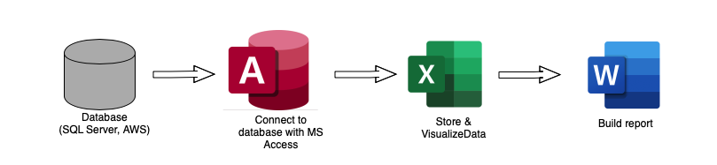
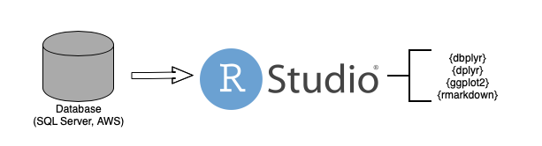

```{r setup, include = FALSE}
library(knitr)
library(tidyverse)
library(nhsrtheme)
library(here)
# set default options
opts_chunk$set(eval = FALSE, dpi = 3)

xaringanExtra::use_panelset()

```

class: title-slide, left, bottom

# `r rmarkdown::metadata$title`
----
## **`r rmarkdown::metadata$author`**
### `r rmarkdown::metadata$institute`
### `r rmarkdown::metadata$date`


---

class: center, middle, inverse

# Agenda

----

.center[
Identifying the Gaps 🔎
]


.center[
Connecting to databases with `{dbplyr}` 💾
]


.center[
Importing and transforming 🤠
]


.center[
Building the report 📄 🧶
]

.center[
Conclusion 🙋
]

---
# Identifying the Gaps 🔎

----

--
### Previous Workflow
```{r previous_workflow, out.width="75%" ,echo=FALSE, eval=TRUE}


```

--
### Redesigned Workflow
```{r new_workflow, out.width="75%", echo=FALSE, eval=TRUE}

```


---
# Connecting to databases with `{dbplyr}` 💾

### Making a connection

- `con` is the connection that will be used to access the database.
- Multiple connections can be created but you will have to have different names for each connection.

<br>

```{r db_syntax}
library(dbplyr)
library(DBI)
library(odbc)

# ODBC connection (e.g. Access)
con <- dbConnect(odbc::odbc(), "name_of_connection")

# RSQLite
con <- DBI::dbConnect(RSQLite::SQLite(), dbname = ":memory:")

```


---
# `{dbplyr}` continued

.panelset[
.panel[.panel-name[Writing some R ]

- Most `dplyr` verbs can be translated into their SQL equivalents.  
- When writing `dplyr` verbs you can use them before and/or after collecting the results. 
  * The size of the database will help guide your decision. 

```{r dbplyr_pt3}  

dbplyr::tbl(con, "Class") %>% 
  filter(YEAR == "B90",
         DEPT_DIV %in% c("POLS&", "CHEM&", "ENGL&")) %>% 
  select(YEAR, DEPT_DIV, COURSE_NUM, ENR_TOTAL) %>% 
  group_by(YEAR, DEPT_DIV) %>% 
  summarise(total_enr = sum(ENR_TOTAL, na.rm = T)) %>% 
  dplyr::collect() %>% 
  janitor::clean_name()

```

]

.panel[.panel-name[Results]

- After using `collect()` we see the traditional tibble format for the dataframe.
- Depending on how your database is setup, you may have to fix up some of the column names.
  * This is quickly down with the `clean_names()` function from the `{janitor}` package.

```{r dbplyr_results}

#`summarise()` has grouped output by 'YEAR'. You can override using the `.groups` argument.
# A tibble: 3 x 3
# Groups:   YEAR [1]
  YEAR  DEPT_DIV total_enr
  <chr> <chr>        <dbl>
1 B90   CHEM&          527
2 B90   ENGL&         1436
3 B90   POLS&          239

```

]
]


---
# Importing and visualizing 📊

.panelset[

.panel[.panel-name[More `{dplyr}`]

```{r adv_dplyr}

class_summary <- tbl(con, "Class") %>% 
  filter(YEAR %in% c("B89", "B90"), QUARTER %in% c("1", "2")) %>% 
  select(YEAR, QUARTER, DEPT_DIV, ENR_TOTAL) %>% 
  collect() %>% 
  janitor::clean_names() %>% 
  group_by(year, quarter, dept_div) %>% 
  summarise(
    total_enr = sum(enr_total, na.rm = T)
  ) %>% 
  ungroup() %>% 
  group_by(year, quarter) %>% 
  arrange(desc(total_enr)) %>% 
  slice(1:5) %>% 
  mutate(quarter = case_when(quarter == "2" ~ "Fall",
                             TRUE ~ "Winter"),
         year = case_when(year == "B89" ~ "2018-19",
                          TRUE ~ "2019-20")) %>% 
  arrange(year, quarter)

```
]


.panel[.panel-name[Visualizing]


.pull-left[

- If your report includes tables, there are many packages (e.g `{gt}`, `{flextable}`, `{kable}`...) that can help.

```{r gt_example}

class_summary %>%
  pivot_wider(names_from = c(year, quarter), 
              values_from = total_enr) %>%
  arrange(dept_div) %>%
  gt() %>%
  fmt_missing(
    columns = 2:5,
    missing_text = 0
  )

```

]

.pull-right[

- Visualizing data using data from a database connection is no different than working with the `mtcars` dataset.


```{r ggplot_example}

class_summary %>%
  ggplot(aes(dept_div, total_enr, fill = quarter)) +
  geom_col(position = position_dodge()) +
  labs(
    x = "Department",
    y = "Enrollment"
  ) +
  scale_y_continuous(limits = c(0, 600)) +
  facet_wrap(~year) +
  theme_classic()

```
]
]
]


---
# Building the report 📄 🧶

- To report out I used the {rmarkdown} and {bookdown} packages. Each offers consistent and reproducible ways to report out.

- {bookdown} builds on {rmarkdown} so if you use the latter learning {bookdown} will be straight forward.
  
- {bookdown} offers the ability to create a single document instead of the traditional format. Using `pdf_document2()` in the YAML metadata will produce this format.


---
# Reporting syntax

.panelset[
.panel[.panel-name[Metadata]

```{r meta}
---
  title: "How Did I Do That?: Redesigning A Workflow In R"
  site: bookdown:bookdown_site
  knit: "bookdown:render_book"
  mainfont: Calibri Light
  indent: yes
  urlcolor: blues
---  
```

]

.panel[.panel-name[YAML]

```{r output.yml}
bookdown::pdf_document2: # allows for a single document
  toc: FALSE
  includes: 
    in_header: preable.tex #where you include your latex specific packages
  latex_engine: xelatex # will need to have {tidytext} installed
  dev: "cairo_pdf"
```

]
]


---
# Conclusion 🙋

- There is going to be upfront work but the payoff is tremendous.

- The ability to avoid human error is reduced since you do not need to jump between programs.

- Next time will simply consist of rerunning your code instead of spending time trying to remember what you did.

- Ability take your workflow further by incorporating `{purrr}`, `{shiny}`, and package development. 


---
# Acknowledgements & Resources

- `{xaringan}`: <a href ="https://github.com/ivelasq/bookclub-dsieur/blob/main/R/2021-03-31/Walkthrough%204.Rmd">Isabella Velásquez</a>
- `{dbplyr}`: 
  - <a href ="https://sciencificity-blog.netlify.app/posts/2021-03-27-sql-in-rmarkdown/">Vebash Naidoo</a>
    * <a href ="https://github.com/tidyverse/dbplyr/tree/master/R">GitHub Repo</a>
- SQL: 
  - <a href ="https://sciencificity-blog.netlify.app/posts/2021-03-27-sql-in-rmarkdown/">Vebash Naidoo</a>
  - <a href ="https://github.com/ianmcook/tidyquery">tidyquery</a>
  - Visualizing `*_joins()` with <a href ="https://www.garrickadenbuie.com/project/tidyexplain/">Garrick Aden‑Buie</a>
- Sharla Gelfand - <a href ="https://www.rstudio.com/speakers/sharla-gelfand/">RStudioConf</a>

---
class: center, middle, inverse


.center[
<p style="font-size:60px">Thank You!!!</p>
]


